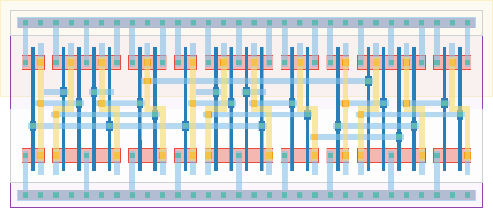

# `mux4` Module


## Cell Hierarchy

`mux4` **21** (number MOS pairs)
- `mux2` **7** *x3*

## Netlist

```
.SUBCKT mux4 IN<0> IN<1> IN<2> IN<3> OUT SEL<0> SEL<1> VDD VSS
    Xi2 net8 net7 OUT SEL<1> VDD VSS mux2
    Xi1 IN<2> IN<3> net7 SEL<0> VDD VSS mux2
    Xi0 IN<0> IN<1> net8 SEL<0> VDD VSS mux2
.ENDS
```
