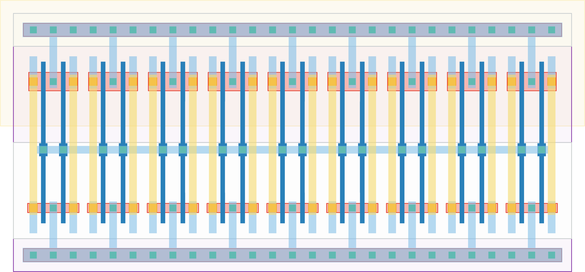

# `one_to_18` Module


## Cell Hierarchy

`one_to_18` **18** (number MOS pairs)
- `inv` **1** *x18*

## Netlist

```
.SUBCKT one_to_18 in out<0> out<1> out<2> out<3> out<4> out<5> out<6> out<7> out<8> out<9> out<10>
                  + out<11> out<12> out<13> out<14> out<15> out<16> out<17> vdd vss
    Xi17 in out<9> vdd vss inv
    Xi16 in out<16> vdd vss inv
    Xi15 in out<17> vdd vss inv
    Xi14 in out<15> vdd vss inv
    Xi13 in out<12> vdd vss inv
    Xi12 in out<14> vdd vss inv
    Xi11 in out<13> vdd vss inv
    Xi10 in out<11> vdd vss inv
    Xi9 in out<10> vdd vss inv
    Xi8 in out<7> vdd vss inv
    Xi7 in out<8> vdd vss inv
    Xi6 in out<6> vdd vss inv
    Xi5 in out<3> vdd vss inv
    Xi4 in out<5> vdd vss inv
    Xi3 in out<4> vdd vss inv
    Xi2 in out<2> vdd vss inv
    Xi1 in out<1> vdd vss inv
    Xi0 in out<0> vdd vss inv
.ENDS
```
