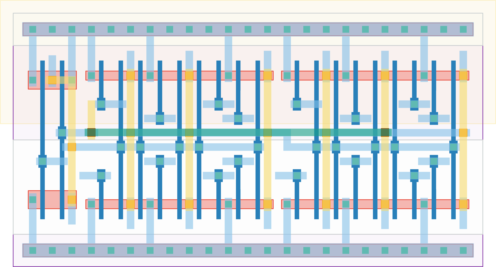

# `ro_2i` Module

## Cell Hierarchy

`ro_2i` **20** (number MOS pairs)
- `inv_conf` **9** *x2*
- `nand2` **2** *x1*
## Netlist

```
.SUBCKT ro_2i CONF'<0> CONF'<1> CONF'<2> CONF'<3> CONF'<4> CONF'<5> CONF'<6> CONF'<7> CONF<0>
              + CONF<1> CONF<2> CONF<3> CONF<4> CONF<5> CONF<6> CONF<7> ENABLE OUT VDD VSS
    Xi1 CONF'<4> CONF'<5> CONF'<6> CONF'<7> CONF<4> CONF<5> CONF<6> CONF<7> INT OUT VDD VSS inv_conf
    Xi0 CONF'<0> CONF'<1> CONF'<2> CONF'<3> CONF<0> CONF<1> CONF<2> CONF<3> NAND_OUT INT VDD VSS
        + inv_conf
    Xi2 OUT ENABLE NAND_OUT VDD VSS nand2
.ENDS
```
