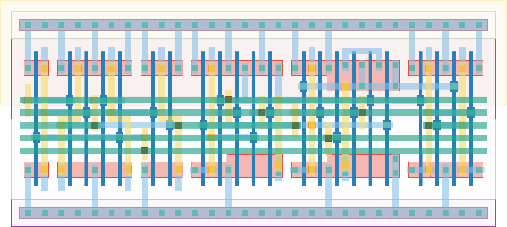

# `scan_1` Module


## Cell Hierarchy

`scan_1` **22** (number MOS pairs)
- `mux2` **7**
- `dff_st_ar` **15**

## Netlist

```
.SUBCKT scan_1 clk in_par in_ser out rst rst' ser vdd vss
    Xi0 in_par in_ser net19 ser vdd vss mux2
    Xi1 clk net19 out net21 rst rst' vdd vss dff_st_ar
.ENDS
```
