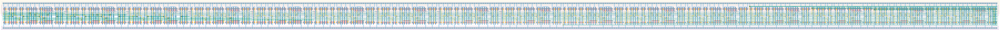

# `scan_16` Module


## Cell Hierarchy

`scan_16` **352** (number MOS pairs)
- `scan_8` **176** *x2*

## Netlist

```
.SUBCKT scan_16 clk in_par<0> in_par<1> in_par<2> in_par<3> in_par<4> in_par<5> in_par<6> in_par<7>
                + in_par<8> in_par<9> in_par<10> in_par<11> in_par<12> in_par<13> in_par<14>
                + in_par<15> in_ser out rst rst' ser vdd vss
    Xi1 clk in_par<8> in_par<9> in_par<10> in_par<11> in_par<12> in_par<13> in_par<14> in_par<15>
        + net13 out rst rst' ser vdd vss scan_8
    Xi0 clk in_par<0> in_par<1> in_par<2> in_par<3> in_par<4> in_par<5> in_par<6> in_par<7> in_ser
        + net13 rst rst' ser vdd vss scan_8
.ENDS
```
