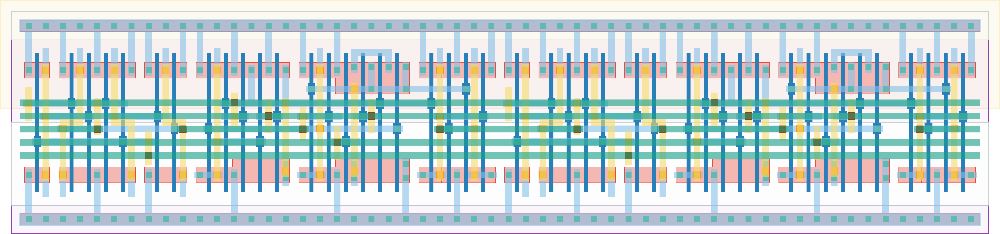

# `scan_2` Module


## Cell Hierarchy

`scan_2` **44** (number MOS pairs)
- `scan_1` **22** *x2*

## Netlist

```
.SUBCKT scan_2 clk in_par<0> in_par<1> in_ser out rst rst' ser vdd vss
    Xi1 clk in_par<1> net13 out rst rst' ser vdd vss scan_1
    Xi0 clk in_par<0> in_ser net13 rst rst' ser vdd vss scan_1
.ENDS
```
