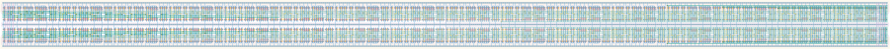

# `scan_32` Module


## Cell Hierarchy

`scan_32` **704** (number MOS pairs)
- `scan_16` **352** *x2*

## Netlist

```
.SUBCKT scan_32 clk in_par<0> in_par<1> in_par<2> in_par<3> in_par<4> in_par<5> in_par<6> in_par<7>
                + in_par<8> in_par<9> in_par<10> in_par<11> in_par<12> in_par<13> in_par<14>
                + in_par<15> in_par<16> in_par<17> in_par<18> in_par<19> in_par<20> in_par<21>
                + in_par<22> in_par<23> in_par<24> in_par<25> in_par<26> in_par<27> in_par<28>
                + in_par<29> in_par<30> in_par<31> in_ser out rst rst' ser vdd vss
    Xi1 clk in_par<16> in_par<17> in_par<18> in_par<19> in_par<20> in_par<21> in_par<22> in_par<23>
        + in_par<24> in_par<25> in_par<26> in_par<27> in_par<28> in_par<29> in_par<30> in_par<31>
        + net13 out rst rst' ser vdd vss scan_16
    Xi0 clk in_par<0> in_par<1> in_par<2> in_par<3> in_par<4> in_par<5> in_par<6> in_par<7>
        + in_par<8> in_par<9> in_par<10> in_par<11> in_par<12> in_par<13> in_par<14> in_par<15>
        + in_ser net13 rst rst' ser vdd vss scan_16
.ENDS
```
