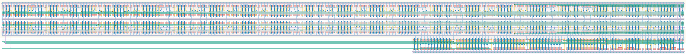

# `scan_34` Module


## Cell Hierarchy

`scan_34` **769** (number MOS pairs)
- `inv` **1**
- `scan_32` **704**
- `scan_2` **44**
- `buffer_large` **4** *x5*

## Netlist

```
.SUBCKT scan_34 clk in_par<0> in_par<1> in_par<2> in_par<3> in_par<4> in_par<5> in_par<6> in_par<7>
                + in_par<8> in_par<9> in_par<10> in_par<11> in_par<12> in_par<13> in_par<14>
                + in_par<15> in_par<16> in_par<17> in_par<18> in_par<19> in_par<20> in_par<21>
                + in_par<22> in_par<23> in_par<24> in_par<25> in_par<26> in_par<27> in_par<28>
                + in_par<29> in_par<30> in_par<31> in_par<32> in_par<33> in_ser out rst ser vdd vss
    Xi2 rst rst' vdd vss inv
    Xi0 clk_i in_par<0> in_par<1> in_par<2> in_par<3> in_par<4> in_par<5> in_par<6> in_par<7>
        + in_par<8> in_par<9> in_par<10> in_par<11> in_par<12> in_par<13> in_par<14> in_par<15>
        + in_par<16> in_par<17> in_par<18> in_par<19> in_par<20> in_par<21> in_par<22> in_par<23>
        + in_par<24> in_par<25> in_par<26> in_par<27> in_par<28> in_par<29> in_par<30> in_par<31>
        + in_ser net13 rst_i rst'_i ser_i vdd vss scan_32
    Xi1 clk_i in_par<32> in_par<33> net13 out_i rst_i rst'_i ser_i vdd vss scan_2
    Xi7 out_i out vdd vss buffer_large
    Xi6 ser ser_i vdd vss buffer_large
    Xi5 clk clk_i vdd vss buffer_large
    Xi4 rst rst_i vdd vss buffer_large
    Xi3 rst' rst'_i vdd vss buffer_large
.ENDS
```
