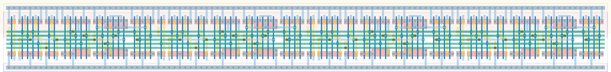

# `scan_4` Module


## Cell Hierarchy

`scan_4` **88** (number MOS pairs)
- `scan_2` **44** *x2*

## Netlist

```
.SUBCKT scan_4 clk in_par<0> in_par<1> in_par<2> in_par<3> in_ser out rst rst' ser vdd vss
    Xi1 clk in_par<2> in_par<3> net13 out rst rst' ser vdd vss scan_2
    Xi0 clk in_par<0> in_par<1> in_ser net13 rst rst' ser vdd vss scan_2
.ENDS
```
