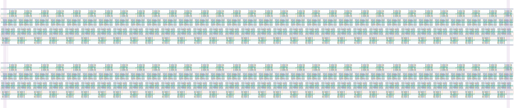

# `scan_jit_128` Module


## Cell Hierarchy

`scan_jit_128` **2816** (number MOS pairs)
- `scan_jit_64` **1408** *x2*

## Netlist

```
.SUBCKT scan_jit_128 clk in_par<0> in_par<1> in_par<2> in_par<3> in_par<4> in_par<5> in_par<6>
                     + in_par<7> in_par<8> in_par<9> in_par<10> in_par<11> in_par<12> in_par<13>
                     + in_par<14> in_par<15> in_par<16> in_par<17> in_par<18> in_par<19> in_par<20>
                     + in_par<21> in_par<22> in_par<23> in_par<24> in_par<25> in_par<26> in_par<27>
                     + in_par<28> in_par<29> in_par<30> in_par<31> in_par<32> in_par<33> in_par<34>
                     + in_par<35> in_par<36> in_par<37> in_par<38> in_par<39> in_par<40> in_par<41>
                     + in_par<42> in_par<43> in_par<44> in_par<45> in_par<46> in_par<47> in_par<48>
                     + in_par<49> in_par<50> in_par<51> in_par<52> in_par<53> in_par<54> in_par<55>
                     + in_par<56> in_par<57> in_par<58> in_par<59> in_par<60> in_par<61> in_par<62>
                     + in_par<63> in_par<64> in_par<65> in_par<66> in_par<67> in_par<68> in_par<69>
                     + in_par<70> in_par<71> in_par<72> in_par<73> in_par<74> in_par<75> in_par<76>
                     + in_par<77> in_par<78> in_par<79> in_par<80> in_par<81> in_par<82> in_par<83>
                     + in_par<84> in_par<85> in_par<86> in_par<87> in_par<88> in_par<89> in_par<90>
                     + in_par<91> in_par<92> in_par<93> in_par<94> in_par<95> in_par<96> in_par<97>
                     + in_par<98> in_par<99> in_par<100> in_par<101> in_par<102> in_par<103>
                     + in_par<104> in_par<105> in_par<106> in_par<107> in_par<108> in_par<109>
                     + in_par<110> in_par<111> in_par<112> in_par<113> in_par<114> in_par<115>
                     + in_par<116> in_par<117> in_par<118> in_par<119> in_par<120> in_par<121>
                     + in_par<122> in_par<123> in_par<124> in_par<125> in_par<126> in_par<127>
                     + in_ser out rst rst' ser vdd vss
    Xi5 clk in_par<0> in_par<1> in_par<2> in_par<3> in_par<4> in_par<5> in_par<6> in_par<7>
        + in_par<8> in_par<9> in_par<10> in_par<11> in_par<12> in_par<13> in_par<14> in_par<15>
        + in_par<16> in_par<17> in_par<18> in_par<19> in_par<20> in_par<21> in_par<22> in_par<23>
        + in_par<24> in_par<25> in_par<26> in_par<27> in_par<28> in_par<29> in_par<30> in_par<31>
        + in_par<32> in_par<33> in_par<34> in_par<35> in_par<36> in_par<37> in_par<38> in_par<39>
        + in_par<40> in_par<41> in_par<42> in_par<43> in_par<44> in_par<45> in_par<46> in_par<47>
        + in_par<48> in_par<49> in_par<50> in_par<51> in_par<52> in_par<53> in_par<54> in_par<55>
        + in_par<56> in_par<57> in_par<58> in_par<59> in_par<60> in_par<61> in_par<62> in_par<63>
        + in_ser net8 rst rst' ser vdd vss scan_jit_64
    Xi6 clk in_par<64> in_par<65> in_par<66> in_par<67> in_par<68> in_par<69> in_par<70> in_par<71>
        + in_par<72> in_par<73> in_par<74> in_par<75> in_par<76> in_par<77> in_par<78> in_par<79>
        + in_par<80> in_par<81> in_par<82> in_par<83> in_par<84> in_par<85> in_par<86> in_par<87>
        + in_par<88> in_par<89> in_par<90> in_par<91> in_par<92> in_par<93> in_par<94> in_par<95>
        + in_par<96> in_par<97> in_par<98> in_par<99> in_par<100> in_par<101> in_par<102>
        + in_par<103> in_par<104> in_par<105> in_par<106> in_par<107> in_par<108> in_par<109>
        + in_par<110> in_par<111> in_par<112> in_par<113> in_par<114> in_par<115> in_par<116>
        + in_par<117> in_par<118> in_par<119> in_par<120> in_par<121> in_par<122> in_par<123>
        + in_par<124> in_par<125> in_par<126> in_par<127> net8 out rst rst' ser vdd vss scan_jit_64
.ENDS
```
