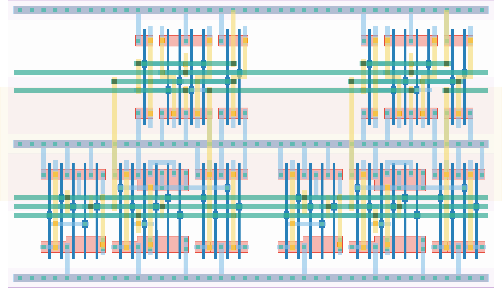

# `scan_jit_2` Module


## Cell Hierarchy

`scan_jit_2` **44** (number MOS pairs)
- `dff_st_ar` **15** *x2*
- `mux2` **7** *x2*

## Netlist

```
.SUBCKT scan_jit_2 clk in_par<0> in_par<1> in_ser out rst rst' ser vdd vss
    Xi1 clk net12 out net14 rst rst' vdd vss dff_st_ar
    Xi0 clk net07 net11 net15 rst rst' vdd vss dff_st_ar
    Xi4 in_par<0> in_ser net07 ser vdd vss mux2
    Xi2 in_par<1> net11 net12 ser vdd vss mux2
.ENDS
```
