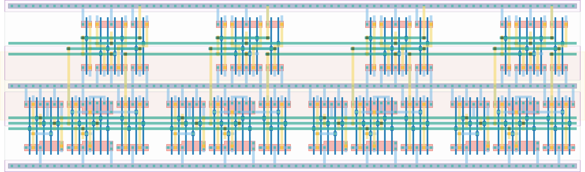

# `scan_jit_4` Module


## Cell Hierarchy

`scan_jit_4` **88** (number MOS pairs)
- `scan_jit_2` **44** *x2*

## Netlist

```
.SUBCKT scan_jit_4 clk in_par<0> in_par<1> in_par<2> in_par<3> in_ser out rst rst' ser vdd vss
    Xi5 clk in_par<0> in_par<1> in_ser net8 rst rst' ser vdd vss scan_jit_2
    Xi6 clk in_par<2> in_par<3> net8 out rst rst' ser vdd vss scan_jit_2
.ENDS
```
