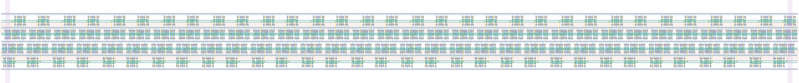

# `scan_jit_64` Module


## Cell Hierarchy

`scan_jit_64` **1408** (number MOS pairs)
- `scan_jit_32` **704** *x2*

## Netlist

```
.SUBCKT scan_jit_64 clk in_par<0> in_par<1> in_par<2> in_par<3> in_par<4> in_par<5> in_par<6>
                    + in_par<7> in_par<8> in_par<9> in_par<10> in_par<11> in_par<12> in_par<13>
                    + in_par<14> in_par<15> in_par<16> in_par<17> in_par<18> in_par<19> in_par<20>
                    + in_par<21> in_par<22> in_par<23> in_par<24> in_par<25> in_par<26> in_par<27>
                    + in_par<28> in_par<29> in_par<30> in_par<31> in_par<32> in_par<33> in_par<34>
                    + in_par<35> in_par<36> in_par<37> in_par<38> in_par<39> in_par<40> in_par<41>
                    + in_par<42> in_par<43> in_par<44> in_par<45> in_par<46> in_par<47> in_par<48>
                    + in_par<49> in_par<50> in_par<51> in_par<52> in_par<53> in_par<54> in_par<55>
                    + in_par<56> in_par<57> in_par<58> in_par<59> in_par<60> in_par<61> in_par<62>
                    + in_par<63> in_ser out rst rst' ser vdd vss
    Xi5 clk in_par<0> in_par<1> in_par<2> in_par<3> in_par<4> in_par<5> in_par<6> in_par<7>
        + in_par<8> in_par<9> in_par<10> in_par<11> in_par<12> in_par<13> in_par<14> in_par<15>
        + in_par<16> in_par<17> in_par<18> in_par<19> in_par<20> in_par<21> in_par<22> in_par<23>
        + in_par<24> in_par<25> in_par<26> in_par<27> in_par<28> in_par<29> in_par<30> in_par<31>
        + in_ser net8 rst rst' ser vdd vss scan_jit_32
    Xi6 clk in_par<32> in_par<33> in_par<34> in_par<35> in_par<36> in_par<37> in_par<38> in_par<39>
        + in_par<40> in_par<41> in_par<42> in_par<43> in_par<44> in_par<45> in_par<46> in_par<47>
        + in_par<48> in_par<49> in_par<50> in_par<51> in_par<52> in_par<53> in_par<54> in_par<55>
        + in_par<56> in_par<57> in_par<58> in_par<59> in_par<60> in_par<61> in_par<62> in_par<63>
        + net8 out rst rst' ser vdd vss scan_jit_32
.ENDS
```
