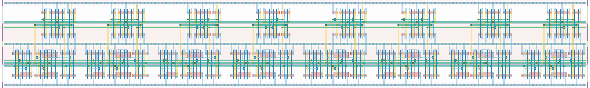

# `scan_jit_8` Module


## Cell Hierarchy

`scan_jit_8` **176** (number MOS pairs)
- `scan_jit_4` **88** *x2*

## Netlist

```
.SUBCKT scan_jit_8 clk in_par<0> in_par<1> in_par<2> in_par<3> in_par<4> in_par<5> in_par<6>
                   + in_par<7> in_ser out rst rst' ser vdd vss
    Xi5 clk in_par<0> in_par<1> in_par<2> in_par<3> in_ser net8 rst rst' ser vdd vss scan_jit_4
    Xi6 clk in_par<4> in_par<5> in_par<6> in_par<7> net8 out rst rst' ser vdd vss scan_jit_4
.ENDS
```
