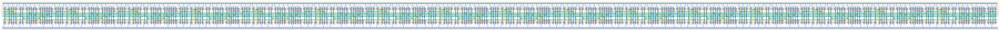

# `shift_reg_16` Module


## Cell Hierarchy

`shift_reg_16` **352** (number MOS pairs)
- `shift_reg_8` **176** *x2*

## Netlist

```
.SUBCKT shift_reg_16 clk in<0> in<1> in<2> in<3> in<4> in<5> in<6> in<7> in<8> in<9> in<10> in<11>
                     + in<12> in<13> in<14> in<15> in_ser out rst rst' sel_ser vdd vss
    Xi1 clk in<8> in<9> in<10> in<11> in<12> in<13> in<14> in<15> net016 out rst rst' sel_ser vdd
        + vss shift_reg_8
    Xi0 clk in<0> in<1> in<2> in<3> in<4> in<5> in<6> in<7> in_ser net016 rst rst' sel_ser vdd vss
        + shift_reg_8
.ENDS
```
