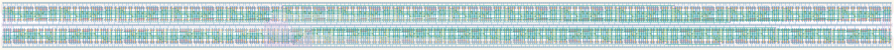

# `shift_reg_32` Module


## Cell Hierarchy

`shift_reg_32` **704** (number MOS pairs)
- `shift_reg_16` **352** *x2*

## Netlist

```
.SUBCKT shift_reg_32 clk in<0> in<1> in<2> in<3> in<4> in<5> in<6> in<7> in<8> in<9> in<10> in<11>
                     + in<12> in<13> in<14> in<15> in<16> in<17> in<18> in<19> in<20> in<21> in<22>
                     + in<23> in<24> in<25> in<26> in<27> in<28> in<29> in<30> in<31> in_ser out rst
                     + rst' sel_ser vdd vss
    Xi1 clk in<16> in<17> in<18> in<19> in<20> in<21> in<22> in<23> in<24> in<25> in<26> in<27>
        + in<28> in<29> in<30> in<31> net7 out rst rst' sel_ser vdd vss shift_reg_16
    Xi0 clk in<0> in<1> in<2> in<3> in<4> in<5> in<6> in<7> in<8> in<9> in<10> in<11> in<12> in<13>
        + in<14> in<15> in_ser net7 rst rst' sel_ser vdd vss shift_reg_16
.ENDS
```
