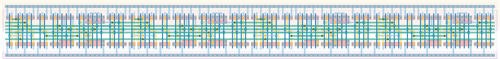

# `shift_reg_4` Module


## Cell Hierarchy

`shift_reg_4` **88** (number MOS pairs)
- `mux2` **7** *x4*
- `dff_st_ar` **15** *x4*

## Netlist

```
.SUBCKT shift_reg_4 clk in<0> in<1> in<2> in<3> in_ser out rst rst' sel_ser vdd vss
    Xi7 in<0> in_ser net3 sel_ser vdd vss mux2
    Xi6 in<1> int<0> net42 sel_ser vdd vss mux2
    Xi5 in<2> int<1> net35 sel_ser vdd vss mux2
    Xi4 in<3> int<2> net17 sel_ser vdd vss mux2
    Xi9 clk net42 int<1> net40 rst rst' vdd vss dff_st_ar
    Xi10 clk net35 int<2> net32 rst rst' vdd vss dff_st_ar
    Xi11 clk net17 out net24 rst rst' vdd vss dff_st_ar
    Xi8 clk net3 int<0> net45 rst rst' vdd vss dff_st_ar
.ENDS
```
