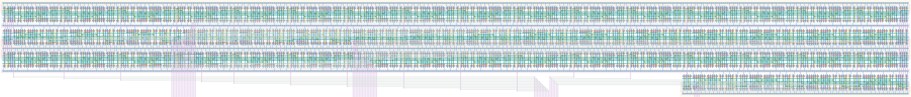

# `shift_reg_52` Module


## Cell Hierarchy

`shift_reg_52` **1144** (number MOS pairs)
- `shift_reg_16` **352** *x3*
- `shift_reg_4` **88**

## Netlist

```
.SUBCKT shift_reg_52 clk in<0> in<1> in<2> in<3> in<4> in<5> in<6> in<7> in<8> in<9> in<10> in<11>
                     + in<12> in<13> in<14> in<15> in<16> in<17> in<18> in<19> in<20> in<21> in<22>
                     + in<23> in<24> in<25> in<26> in<27> in<28> in<29> in<30> in<31> in<32> in<33>
                     + in<34> in<35> in<36> in<37> in<38> in<39> in<40> in<41> in<42> in<43> in<44>
                     + in<45> in<46> in<47> in<48> in<49> in<50> in<51> in_ser out rst rst' sel_ser
                     + vdd vss
    Xi2 clk in<32> in<33> in<34> in<35> in<36> in<37> in<38> in<39> in<40> in<41> in<42> in<43>
        + in<44> in<45> in<46> in<47> net6 net7 rst rst' sel_ser vdd vss shift_reg_16
    Xi1 clk in<16> in<17> in<18> in<19> in<20> in<21> in<22> in<23> in<24> in<25> in<26> in<27>
        + in<28> in<29> in<30> in<31> net5 net6 rst rst' sel_ser vdd vss shift_reg_16
    Xi0 clk in<0> in<1> in<2> in<3> in<4> in<5> in<6> in<7> in<8> in<9> in<10> in<11> in<12> in<13>
        + in<14> in<15> in_ser net5 rst rst' sel_ser vdd vss shift_reg_16
    Xi3 clk in<48> in<49> in<50> in<51> net7 out rst rst' sel_ser vdd vss shift_reg_4
.ENDS
```
