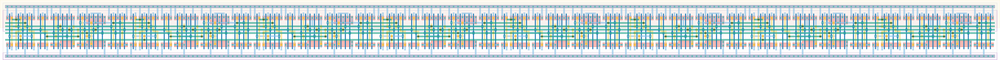

# `shift_reg_8` Module


## Cell Hierarchy

`shift_reg_8` **176** (number MOS pairs)
- `shift_reg_4` **88** *x2*

## Netlist

```
.SUBCKT shift_reg_8 clk in<0> in<1> in<2> in<3> in<4> in<5> in<6> in<7> in_ser out rst rst' sel_ser
                    + vdd vss
    Xi1 clk in<4> in<5> in<6> in<7> net3 out rst rst' sel_ser vdd vss shift_reg_4
    Xi0 clk in<0> in<1> in<2> in<3> in_ser net3 rst rst' sel_ser vdd vss shift_reg_4
.ENDS
```
