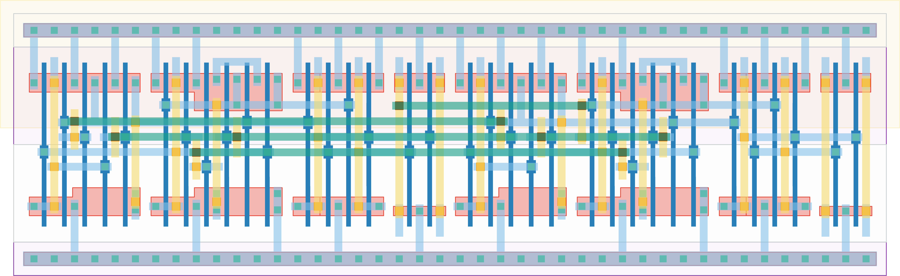

# `synchronizer` Module


## Cell Hierarchy

`synchronizer` **34** (number MOS pairs)
- `dff_st_ar_buf` **17** *x2*

## Netlist

```
.SUBCKT synchronizer clk in out rst rst' vdd vss
    Xi1 clk net18 out net16 rst rst' vdd vss dff_st_ar_buf
    Xi0 clk in net18 net19 rst rst' vdd vss dff_st_ar_buf
.ENDS
```
