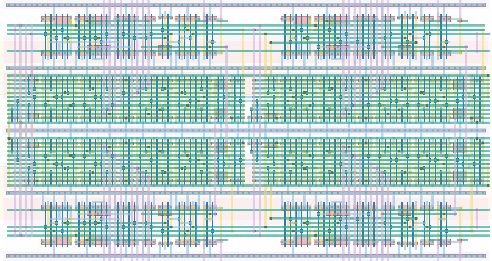

# `tdc_2e_1b_diff_np_4lin_buf` Module


## Cell Hierarchy

`tdc_2e_1b_diff_np_4lin_buf` **234** (number MOS pairs)
- `tdc_2stage_diff_np_4lin_buf` **116**
- `tdc_2stage_diff_np_4lin_switched_buf` **118**

## Netlist

```
.SUBCKT tdc_2e_1b_diff_np_4lin_buf buf0_n<0> buf0_n<1> buf0_p<0> buf0_p<1> buf1_n<0> buf1_n<1>
                                   + buf1_p<0> buf1_p<1> conf0_n<0> conf0_n<1> conf0_n<2> conf0_n<3>
                                   + conf0_n<4> conf0_n<5> conf0_n<6> conf0_n<7> conf0_p<0>
                                   + conf0_p<1> conf0_p<2> conf0_p<3> conf0_p<4> conf0_p<5>
                                   + conf0_p<6> conf0_p<7> conf1_n<0> conf1_n<1> conf1_n<2>
                                   + conf1_n<3> conf1_n<4> conf1_n<5> conf1_n<6> conf1_n<7>
                                   + conf1_p<0> conf1_p<1> conf1_p<2> conf1_p<3> conf1_p<4>
                                   + conf1_p<5> conf1_p<6> conf1_p<7> edge0_n edge0_p edge1_n
                                   + edge1_p ff0<0> ff0<1> ff1<0> ff1<1> rst rst' vdd vss
    Xi13 buf0_n<1> buf0_p<1> buf1_n<1> buf1_p<1> conf0_n<4> conf0_n<5> conf0_n<6> conf0_n<7>
         + conf0_p<4> conf0_p<5> conf0_p<6> conf0_p<7> conf1_n<4> conf1_n<5> conf1_n<6> conf1_n<7>
         + conf1_p<4> conf1_p<5> conf1_p<6> conf1_p<7> ff0<1> ff1<1> int0_n<0> int0_p<0> int1_n<0>
         + int1_p<0> nand0<0> nand0<1> nand1<0> nand1<1> int0_n<1> int0_p<1> int1_n<1> int1_p<1> rst
         + rst' vdd vss tdc_2stage_diff_np_4lin_buf
    Xi12 buf0_n<0> buf0_p<0> buf1_n<0> buf1_p<0> conf0_n<0> conf0_n<1> conf0_n<2> conf0_n<3>
         + conf0_p<0> conf0_p<1> conf0_p<2> conf0_p<3> conf1_n<0> conf1_n<1> conf1_n<2> conf1_n<3>
         + conf1_p<0> conf1_p<1> conf1_p<2> conf1_p<3> edge0_n edge0_p edge1_n edge1_p ff0<0> ff1<0>
         + int1_n<1> int1_p<1> int0_n<1> int0_p<1> nand1<1> nand0<0> nand0<1> nand1<0> int0_n<0>
         + int0_p<0> int1_n<0> int1_p<0> rst rst' vdd vss tdc_2stage_diff_np_4lin_switched_buf
.ENDS
```
