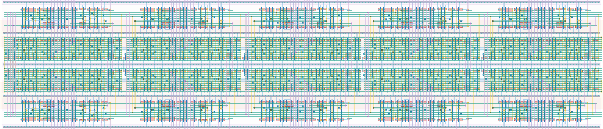

# `tdc_2e_4b_diff_np_4lin_buf` Module


## Cell Hierarchy

`tdc_2e_4b_diff_np_4lin_buf` **582** (number MOS pairs)
- `tdc_2stage_diff_np_4lin_buf` **116** *x4*
- `tdc_2stage_diff_np_4lin_switched_buf` **118**

## Netlist

```
.SUBCKT tdc_2e_4b_diff_np_4lin_buf buf0_n<0> buf0_n<1> buf0_n<2> buf0_n<3> buf0_n<4> buf0_p<0>
                                   + buf0_p<1> buf0_p<2> buf0_p<3> buf0_p<4> buf1_n<0> buf1_n<1>
                                   + buf1_n<2> buf1_n<3> buf1_n<4> buf1_p<0> buf1_p<1> buf1_p<2>
                                   + buf1_p<3> buf1_p<4> conf0_n<0> conf0_n<1> conf0_n<2> conf0_n<3>
                                   + conf0_n<4> conf0_n<5> conf0_n<6> conf0_n<7> conf0_n<8>
                                   + conf0_n<9> conf0_n<10> conf0_n<11> conf0_n<12> conf0_n<13>
                                   + conf0_n<14> conf0_n<15> conf0_n<16> conf0_n<17> conf0_n<18>
                                   + conf0_n<19> conf0_p<0> conf0_p<1> conf0_p<2> conf0_p<3>
                                   + conf0_p<4> conf0_p<5> conf0_p<6> conf0_p<7> conf0_p<8>
                                   + conf0_p<9> conf0_p<10> conf0_p<11> conf0_p<12> conf0_p<13>
                                   + conf0_p<14> conf0_p<15> conf0_p<16> conf0_p<17> conf0_p<18>
                                   + conf0_p<19> conf1_n<0> conf1_n<1> conf1_n<2> conf1_n<3>
                                   + conf1_n<4> conf1_n<5> conf1_n<6> conf1_n<7> conf1_n<8>
                                   + conf1_n<9> conf1_n<10> conf1_n<11> conf1_n<12> conf1_n<13>
                                   + conf1_n<14> conf1_n<15> conf1_n<16> conf1_n<17> conf1_n<18>
                                   + conf1_n<19> conf1_p<0> conf1_p<1> conf1_p<2> conf1_p<3>
                                   + conf1_p<4> conf1_p<5> conf1_p<6> conf1_p<7> conf1_p<8>
                                   + conf1_p<9> conf1_p<10> conf1_p<11> conf1_p<12> conf1_p<13>
                                   + conf1_p<14> conf1_p<15> conf1_p<16> conf1_p<17> conf1_p<18>
                                   + conf1_p<19> edge0_n edge0_p edge1_n edge1_p ff0<0> ff0<1>
                                   + ff0<2> ff0<3> ff0<4> ff1<0> ff1<1> ff1<2> ff1<3> ff1<4> rst
                                   + rst' vdd vss
    Xi21 buf0_n<2> buf0_p<2> buf1_n<2> buf1_p<2> conf0_n<8> conf0_n<9> conf0_n<10> conf0_n<11>
         + conf0_p<8> conf0_p<9> conf0_p<10> conf0_p<11> conf1_n<8> conf1_n<9> conf1_n<10>
         + conf1_n<11> conf1_p<8> conf1_p<9> conf1_p<10> conf1_p<11> ff0<2> ff1<2> int0_n<1>
         + int0_p<1> int1_n<1> int1_p<1> nand0<1> nand0<2> nand1<1> nand1<2> int0_n<2> int0_p<2>
         + int1_n<2> int1_p<2> rst rst' vdd vss tdc_2stage_diff_np_4lin_buf
    Xi20 buf0_n<1> buf0_p<1> buf1_n<1> buf1_p<1> conf0_n<4> conf0_n<5> conf0_n<6> conf0_n<7>
         + conf0_p<4> conf0_p<5> conf0_p<6> conf0_p<7> conf1_n<4> conf1_n<5> conf1_n<6> conf1_n<7>
         + conf1_p<4> conf1_p<5> conf1_p<6> conf1_p<7> ff0<1> ff1<1> int0_n<0> int0_p<0> int1_n<0>
         + int1_p<0> nand0<0> nand0<1> nand1<0> nand1<1> int0_n<1> int0_p<1> int1_n<1> int1_p<1> rst
         + rst' vdd vss tdc_2stage_diff_np_4lin_buf
    Xi19 buf0_n<4> buf0_p<4> buf1_n<4> buf1_p<4> conf0_n<16> conf0_n<17> conf0_n<18> conf0_n<19>
         + conf0_p<16> conf0_p<17> conf0_p<18> conf0_p<19> conf1_n<16> conf1_n<17> conf1_n<18>
         + conf1_n<19> conf1_p<16> conf1_p<17> conf1_p<18> conf1_p<19> ff0<4> ff1<4> int0_n<3>
         + int0_p<3> int1_n<3> int1_p<3> nand0<3> nand0<4> nand1<3> nand1<4> int0_n<4> int0_p<4>
         + int1_n<4> int1_p<4> rst rst' vdd vss tdc_2stage_diff_np_4lin_buf
    Xi18 buf0_n<3> buf0_p<3> buf1_n<3> buf1_p<3> conf0_n<12> conf0_n<13> conf0_n<14> conf0_n<15>
         + conf0_p<12> conf0_p<13> conf0_p<14> conf0_p<15> conf1_n<12> conf1_n<13> conf1_n<14>
         + conf1_n<15> conf1_p<12> conf1_p<13> conf1_p<14> conf1_p<15> ff0<3> ff1<3> int0_n<2>
         + int0_p<2> int1_n<2> int1_p<2> nand0<2> nand0<3> nand1<2> nand1<3> int0_n<3> int0_p<3>
         + int1_n<3> int1_p<3> rst rst' vdd vss tdc_2stage_diff_np_4lin_buf
    Xi22 buf0_n<0> buf0_p<0> buf1_n<0> buf1_p<0> conf0_n<0> conf0_n<1> conf0_n<2> conf0_n<3>
         + conf0_p<0> conf0_p<1> conf0_p<2> conf0_p<3> conf1_n<0> conf1_n<1> conf1_n<2> conf1_n<3>
         + conf1_p<0> conf1_p<1> conf1_p<2> conf1_p<3> edge0_n edge0_p edge1_n edge1_p ff0<0> ff1<0>
         + int1_n<4> int1_p<4> int0_n<4> int0_p<4> nand1<4> nand0<0> nand0<4> nand1<0> int0_n<0>
         + int0_p<0> int1_n<0> int1_p<0> rst rst' vdd vss tdc_2stage_diff_np_4lin_switched_buf
.ENDS
```
