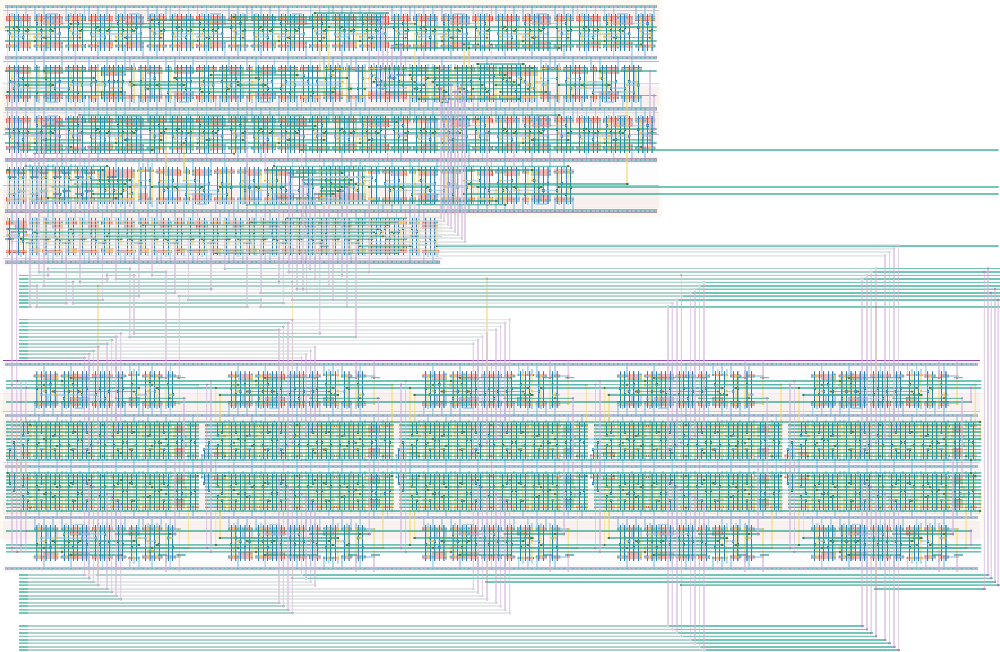

# `tdc_4b_diff_branch` Module


## Cell Hierarchy

`tdc_4b_diff_branch` **1093** (number MOS pairs)
- `dec_10_conf_0` **63**
- `tdc_2e_4b_diff_np_4lin_buf` **582**
- `tdc_ready_6` **448**

## Netlist

```
.SUBCKT tdc_4b_diff_branch alarm<0> alarm<1> buf1_p<0> clk conf0_n<0> conf0_n<1> conf0_n<2>
                           + conf0_n<3> conf0_n<4> conf0_n<5> conf0_n<6> conf0_n<7> conf0_n<8>
                           + conf0_n<9> conf0_n<10> conf0_n<11> conf0_n<12> conf0_n<13> conf0_n<14>
                           + conf0_n<15> conf0_n<16> conf0_n<17> conf0_n<18> conf0_n<19> conf0_p<0>
                           + conf0_p<1> conf0_p<2> conf0_p<3> conf0_p<4> conf0_p<5> conf0_p<6>
                           + conf0_p<7> conf0_p<8> conf0_p<9> conf0_p<10> conf0_p<11> conf0_p<12>
                           + conf0_p<13> conf0_p<14> conf0_p<15> conf0_p<16> conf0_p<17> conf0_p<18>
                           + conf0_p<19> conf1_n<0> conf1_n<1> conf1_n<2> conf1_n<3> conf1_n<4>
                           + conf1_n<5> conf1_n<6> conf1_n<7> conf1_n<8> conf1_n<9> conf1_n<10>
                           + conf1_n<11> conf1_n<12> conf1_n<13> conf1_n<14> conf1_n<15> conf1_n<16>
                           + conf1_n<17> conf1_n<18> conf1_n<19> conf1_p<0> conf1_p<1> conf1_p<2>
                           + conf1_p<3> conf1_p<4> conf1_p<5> conf1_p<6> conf1_p<7> conf1_p<8>
                           + conf1_p<9> conf1_p<10> conf1_p<11> conf1_p<12> conf1_p<13> conf1_p<14>
                           + conf1_p<15> conf1_p<16> conf1_p<17> conf1_p<18> conf1_p<19> conf_dec<0>
                           + conf_dec<1> conf_dec<2> conf_dec<3> conf_dec<4> conf_dec<5> conf_dec<6>
                           + conf_dec<7> conf_dec<8> conf_dec<9> conf_maxcycles<0> conf_maxcycles<1>
                           + conf_maxcycles<2> conf_maxcycles<3> conf_maxcycles<4> conf_maxcycles<5>
                           + conf_maxcycles<6> conf_maxcycles<7> conf_waitcycles<0>
                           + conf_waitcycles<1> conf_waitcycles<2> conf_waitcycles<3>
                           + conf_waitcycles<4> conf_waitcycles<5> conf_waitcycles<6>
                           + conf_waitcycles<7> edge0_n edge0_p edge1_n edge1_p enable_e2l ff<0>
                           + ff<1> ff<2> ff<3> ff<4> ff<5> ff<6> ff<7> ff<8> ff<9> rand_out ready
                           + rst rst' vdd vss
    Xi7 conf_dec<0> conf_dec<1> conf_dec<2> conf_dec<3> conf_dec<4> conf_dec<5> conf_dec<6>
        + conf_dec<7> conf_dec<8> conf_dec<9> ff<0> ff<1> ff<2> ff<3> ff<4> ff<5> ff<6> ff<7> ff<8>
        + ff<9> rand_out vdd vss dec_10_conf_0
    Xi1 net35<0> net35<1> net35<2> net35<3> net35<4> buf0_p<0> buf0_p<1> buf0_p<2> buf0_p<3>
        + buf0_p<4> net34<0> net34<1> net34<2> net34<3> net34<4> buf1_p<0> buf1_p<1> buf1_p<2>
        + buf1_p<3> buf1_p<4> conf0_n<0> conf0_n<1> conf0_n<2> conf0_n<3> conf0_n<4> conf0_n<5>
        + conf0_n<6> conf0_n<7> conf0_n<8> conf0_n<9> conf0_n<10> conf0_n<11> conf0_n<12>
        + conf0_n<13> conf0_n<14> conf0_n<15> conf0_n<16> conf0_n<17> conf0_n<18> conf0_n<19>
        + conf0_p<0> conf0_p<1> conf0_p<2> conf0_p<3> conf0_p<4> conf0_p<5> conf0_p<6> conf0_p<7>
        + conf0_p<8> conf0_p<9> conf0_p<10> conf0_p<11> conf0_p<12> conf0_p<13> conf0_p<14>
        + conf0_p<15> conf0_p<16> conf0_p<17> conf0_p<18> conf0_p<19> conf1_n<0> conf1_n<1>
        + conf1_n<2> conf1_n<3> conf1_n<4> conf1_n<5> conf1_n<6> conf1_n<7> conf1_n<8> conf1_n<9>
        + conf1_n<10> conf1_n<11> conf1_n<12> conf1_n<13> conf1_n<14> conf1_n<15> conf1_n<16>
        + conf1_n<17> conf1_n<18> conf1_n<19> conf1_p<0> conf1_p<1> conf1_p<2> conf1_p<3> conf1_p<4>
        + conf1_p<5> conf1_p<6> conf1_p<7> conf1_p<8> conf1_p<9> conf1_p<10> conf1_p<11> conf1_p<12>
        + conf1_p<13> conf1_p<14> conf1_p<15> conf1_p<16> conf1_p<17> conf1_p<18> conf1_p<19>
        + edge0_n edge0_p edge1_n edge1_p ff<0> ff<1> ff<2> ff<3> ff<4> ff<5> ff<6> ff<7> ff<8>
        + ff<9> rst rst' vdd vss tdc_2e_4b_diff_np_4lin_buf
    Xi2 alarm<0> alarm<1> clk conf_maxcycles<0> conf_maxcycles<1> conf_maxcycles<2>
        + conf_maxcycles<3> conf_maxcycles<4> conf_maxcycles<5> conf_maxcycles<6> conf_maxcycles<7>
        + conf_waitcycles<0> conf_waitcycles<1> conf_waitcycles<2> conf_waitcycles<3>
        + conf_waitcycles<4> conf_waitcycles<5> conf_waitcycles<6> conf_waitcycles<7> enable_e2l
        + ff<0> ff<1> ff<2> ff<3> ff<4> ff<5> ff<6> ff<7> ff<8> ff<9> buf0_p<0> ready rst rst' vdd
        + vss tdc_ready_6
.ENDS
```
