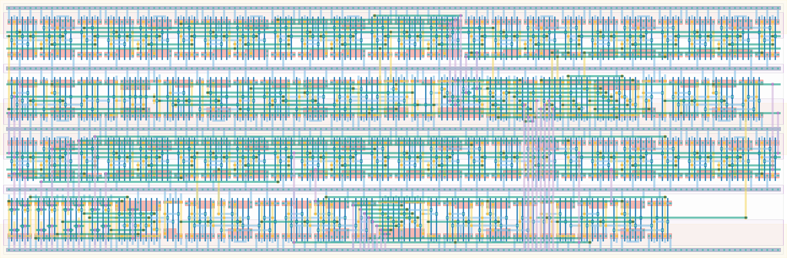

# `tdc_ready_4` Module


## Cell Hierarchy

`tdc_ready_4` **446** (number MOS pairs)
- `max_ready` **161**
- `nand3` **3**
- `wait_ready` **227**
- `inv` **1** *x2*
- `dff_st_ar_dh` **14**
- `dff_st_ar` **15**
- `ff_ready_4` **24**

## Netlist

```
.SUBCKT tdc_ready_4 alarm<0> alarm<1> clk conf_maxcycles<0> conf_maxcycles<1> conf_maxcycles<2>
                    + conf_maxcycles<3> conf_maxcycles<4> conf_maxcycles<5> conf_maxcycles<6>
                    + conf_maxcycles<7> conf_waitcycles<0> conf_waitcycles<1> conf_waitcycles<2>
                    + conf_waitcycles<3> conf_waitcycles<4> conf_waitcycles<5> conf_waitcycles<6>
                    + conf_waitcycles<7> enable_e2l ff0<0> ff0<1> ff0<2> ff0<3> ff1<0> ff1<1> ff1<2>
                    + ff1<3> int ready rst rst' vdd vss
    Xi20 conf_maxcycles<0> conf_maxcycles<1> conf_maxcycles<2> conf_maxcycles<3> conf_maxcycles<4>
         + conf_maxcycles<5> conf_maxcycles<6> conf_maxcycles<7> int net017 rst rst' vdd vss
         + max_ready
    Xi32 alarm<0> net19 net027 ready_i vdd vss nand3
    Xi19 clk conf_waitcycles<0> conf_waitcycles<1> conf_waitcycles<2> conf_waitcycles<3>
         + conf_waitcycles<4> conf_waitcycles<5> conf_waitcycles<6> conf_waitcycles<7> enable_e2l
         + int rst rst' vdd vss wait_ready wait_ready
    Xi28 wait_ready net19 vdd vss inv
    Xi27 ff_ready alarm<0> vdd vss inv
    Xi30 ready_i ready ready' rst rst' vdd vss dff_st_ar_dh
    Xi33 net017 ready' alarm<1> net027 rst rst' vdd vss dff_st_ar
    Xi18 ff0<0> ff0<1> ff0<2> ff0<3> ff1<0> ff1<1> ff1<2> ff1<3> ff_ready rst rst' vdd vss
         + ff_ready_4
.ENDS
```
