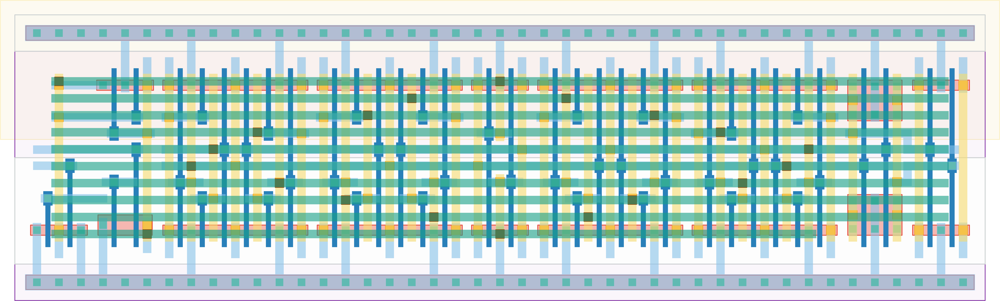

# `tdc_stage_diff_np_4lin_buf` Module


## Cell Hierarchy

`tdc_stage_diff_np_4lin_buf` **34** (number MOS pairs)
- `tdc_and_diff` **4**
- `tdc_buf_diff_np_4lin` **26**
- `tdc_inv` **1** *x2*
- `tdc_inv_wide` **1** *x2*

## Netlist

```
.SUBCKT tdc_stage_diff_np_4lin_buf conf_n<0> conf_n<1> conf_n<2> conf_n<3> conf_p<0> conf_p<1>
                                   + conf_p<2> conf_p<3> in0_n in0_p in1_n in1_p out_buf_n out_buf_p
                                   + out_n out_p vdd vss
    Xi0 in0_n in0_p in1_n in1_p int_n int_p vdd vss tdc_and_diff
    Xi1 conf_n<0> conf_n<1> conf_n<2> conf_n<3> conf_p<0> conf_p<1> conf_p<2> conf_p<3> int_n int_p
        + out_n_i out_p_i vdd vss tdc_buf_diff_np_4lin
    Xi3 out_n out_buf_p vdd vss tdc_inv
    Xi2 out_p out_buf_n vdd vss tdc_inv
    Xi4 out_n_i out_p vdd vss tdc_inv_wide
    Xi5 out_p_i out_n vdd vss tdc_inv_wide
.ENDS
```
