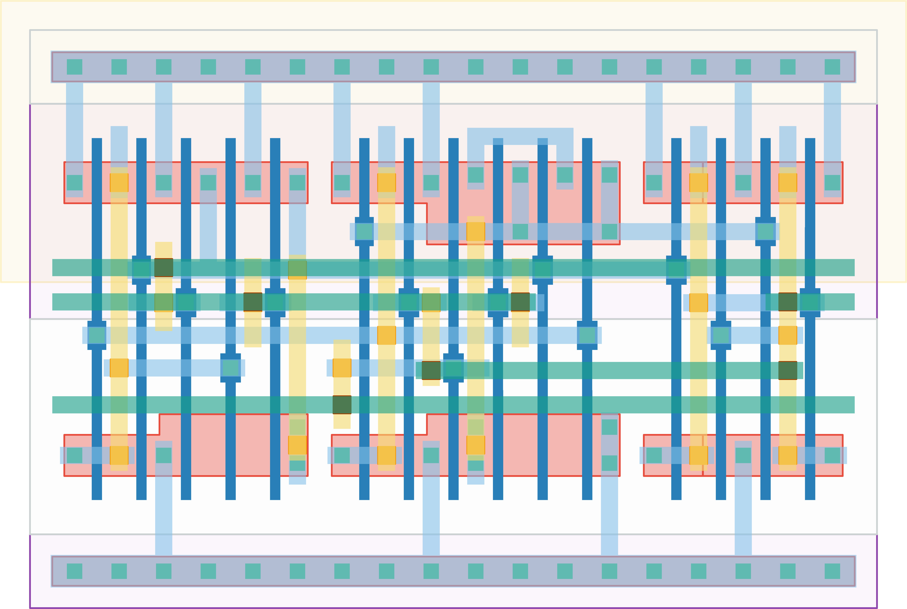

# `tff_st_ar` Module


## Cell Hierarchy

`tff_st_ar` **15** (number MOS pairs)
- `dff_st_ar` **15**

## Netlist

```
.SUBCKT tff_st_ar CLK Q Q' RST RST' VDD VSS
    Xi0 CLK Q' Q Q' RST RST' VDD VSS dff_st_ar
.ENDS
```
