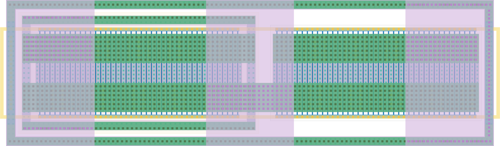

# `vdd_gate_1ma` Module


## Cell Hierarchy

`vdd_gate_1ma` **0** (number MOS pairs)
- `p_mos_lvt` **0**
- `n_mos_lvt` **0**

## Netlist

```
.SUBCKT vdd_gate_1ma enable' vdd_in vdd_out vss
    Mm0 vdd_out enable' vdd_in vdd_in p_mos_lvt l=60n w=4u m=40
    Mm1 vdd_out enable' vss vss n_mos_lvt l=60n w=4u m=40
.ENDS
```
