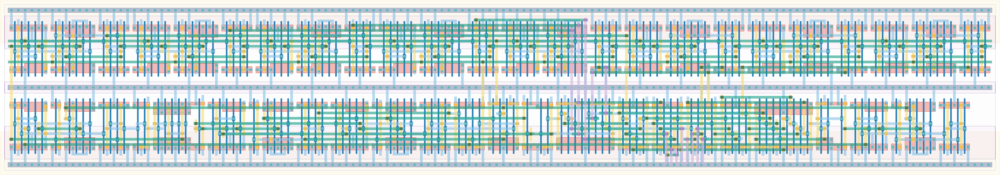

# `wait_ready` Module


## Cell Hierarchy

`wait_ready` **227** (number MOS pairs)
- `async_counter_8` **120**
- `nand2` **2** *x12*
- `nor2` **2** *x3*
- `dff_st_ar_dh` **14** *x4*
- `inv` **1** *x3*
- `nor4` **4** *x2*
- `nand4` **4** *x2*
- `buffer` **2**

## Netlist

```
.SUBCKT wait_ready clk conf_waitcycles<0> conf_waitcycles<1> conf_waitcycles<2> conf_waitcycles<3>
                   + conf_waitcycles<4> conf_waitcycles<5> conf_waitcycles<6> conf_waitcycles<7>
                   + enable_e2l int rst rst' vdd vss wait_ready
    Xi4 clk_int wait_cnt<0> wait_cnt<1> wait_cnt<2> wait_cnt<3> wait_cnt<4> wait_cnt<5> wait_cnt<6>
        + wait_cnt<7> net044 cnt_rst cnt_rst' vdd vss async_counter_8
    Xi26 clk net049 net052 vdd vss nand2
    Xi19 wait_cnt<7> conf_waitcycles<7> waithigh<7> vdd vss nand2
    Xi18 wait_cnt<6> conf_waitcycles<6> waithigh<6> vdd vss nand2
    Xi17 wait_cnt<5> conf_waitcycles<5> waithigh<5> vdd vss nand2
    Xi10 wait_cnt<4> conf_waitcycles<4> waithigh<4> vdd vss nand2
    Xi3 wait_cnt<3> conf_waitcycles<3> waithigh<3> vdd vss nand2
    Xi2 wait_cnt<2> conf_waitcycles<2> waithigh<2> vdd vss nand2
    Xi1 wait_cnt<1> conf_waitcycles<1> waithigh<1> vdd vss nand2
    Xi0 wait_cnt<0> conf_waitcycles<0> waithigh<0> vdd vss nand2
    Xi15 net14 net13 wait_rst_rst' vdd vss nand2
    Xi11 net19 net18 wait_rst vdd vss nand2
    Xi5 wait_rst' rst' cnt_rst vdd vss nand2
    Xi22 net025 net030 net029 vdd vss nor2
    Xi12 edge edge' wait_rst' vdd vss nor2
    Xi6 wait_rst rst cnt_rst' vdd vss nor2
    Xi25 enable_e2l net049 net050 rst rst' vdd vss dff_st_ar_dh
    Xi24 ready wait_ready net034 rst rst' vdd vss dff_st_ar_dh
    Xi8 int edge net18 wait_rst_rst wait_rst_rst' vdd vss dff_st_ar_dh
    Xi7 net15 edge' net19 wait_rst_rst wait_rst_rst' vdd vss dff_st_ar_dh
    Xi23 net029 ready vdd vss inv
    Xi16 wait_rst_rst' wait_rst_rst vdd vss inv
    Xi9 int net15 vdd vss inv
    Xi14 wait_cnt<4> wait_cnt<5> wait_cnt<6> wait_cnt<7> net13 vdd vss nor4
    Xi13 wait_cnt<0> wait_cnt<1> wait_cnt<2> wait_cnt<3> net14 vdd vss nor4
    Xi21 waithigh<0> waithigh<1> waithigh<2> waithigh<3> net025 vdd vss nand4
    Xi20 waithigh<4> waithigh<5> waithigh<6> waithigh<7> net030 vdd vss nand4
    Xi27 net052 clk_int vdd vss buffer
.ENDS
```
